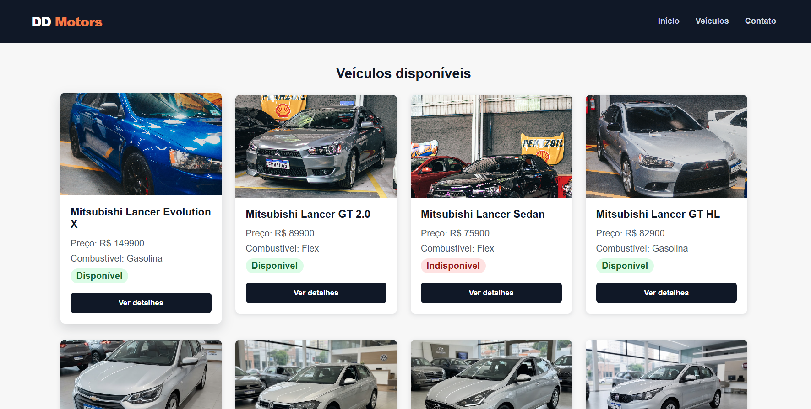
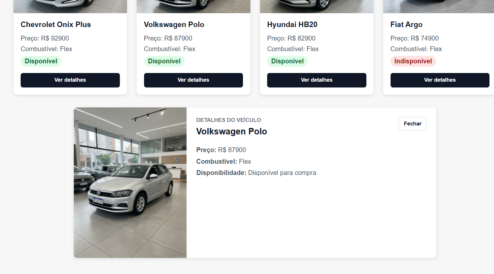
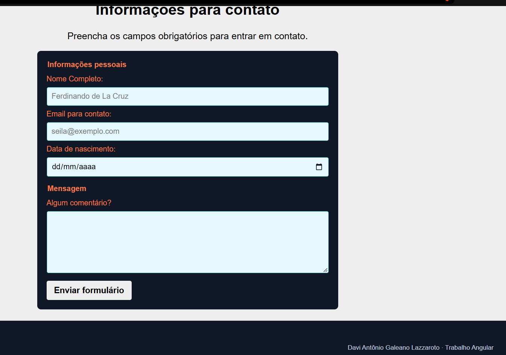

# DD Motors — Concessionária

## Sobre o projeto

Aplicação web de uma concessionária de veículos desenvolvida em Angular para fins acadêmicos na disciplina de Desenvolvimento Web. O projeto apresenta uma página única (SPA) com catálogo de automóveis, verificação de disponibilidade, exibição de detalhes e uma seção de contato com validação de formulário.

## Funcionalidades

- **Catálogo de veículos:** listagem de automóveis contendo foto, marca, modelo, preço e tipo de combustível.
- **Status de disponibilidade:** indicação visual se o veículo está disponível ou indisponível para compra.
- **Visualização de detalhes:** painel com informações detalhadas do veículo selecionado, com opção de fechar.
- **Formulário de contato:** formulário para envio de dúvidas e comentários, com validação de campos obrigatórios (nome e e-mail) e mensagem de confirmação de envio.
- **Navegação rápida:** menu superior com links para início, veículos e contato, além de rodapé informativo.

## Tecnologias utilizadas

- Angular
- TypeScript
- HTML
- CSS

## Conceitos do Angular utilizados

- **Componentes:** divisão da interface em componentes reutilizáveis (`Header`, `Footer`, `VehicleList`, `VehicleCard`, `VehicleDetails`, `Contact`).
- **Interpolação:** exibição dinâmica de dados no template através de `{{ }}`.
- **Property Binding:** envio de dados para propriedades de elementos e componentes filhos usando `[ ]`.
- *_Controle de fluxo (@if/@else e *ngFor):*_ renderização condicional de elementos com `@if`/`@else` e iteração sobre a lista de veículos com `*ngFor`.
- **Formulários Reativos (Reactive Forms):** gerenciamento e validação dos campos de contato via `FormGroup` e `FormControl`.

## Como executar

1. Clone o repositório:

```bash
git clone https://github.com/davilazzaroto/concessionaria-angular.git
```

2. Acesse a pasta do projeto:

```bash
cd concessionaria-angular
```

3. Instale as dependências:

```bash
npm install
```

4. Inicie o servidor de desenvolvimento:

```bash
ng serve
```

A aplicação ficará disponível em:
http://localhost:4200

## Screenshots

### 1. Catálogo de veículos

Apresenta o catálogo principal da DD Motors com os veículos cadastrados, preços, combustível e disponibilidade.



### 2. Detalhes do veículo

O usuário pode selecionar um veículo para visualizar seus detalhes.



### 3. Área de contato

A aplicação possui uma área de contato com formulário demonstrativo.



## Vídeo de apresentação

[Assistir apresentação no YouTube](LINK_DO_VIDEO)
==> falta terminar de gravar e editar o vídeo.
## Autor

Davi Antônio Galeano Lazzaroto
